# WG-ACL Manager (Backend Flask)

API REST que da soporte al frontend del sistema de control de acceso para WireGuard. Responsable de gestionar Peers, Roles, Servicios y autogenerar las reglas ACL para infraestructura.

## 🚀 Funcionalidades y Arquitectura

- **Arquitectura N-Capas**
  - `routes/`: Blueprints de la API de Flask que mapean endpoints REST.
  - `services/`: Capa de lógica de negocio (asignación de accesos, cálculo interconectado de permisos, eliminación en cascada).
  - `repositories/`: Capa de persistencia genérica. Actualmente basada en guardado concurrente (thread-safe) sobre `.json`, fácil de migrar hacia una BBDD SQL o de otro tipo en el futuro.
- **Autenticación Segura (JWT)**
  - Endpoints protegidos implementando autenticación vía token (JWT) mediante `PyJWT`.
  - Hasheo robusto de contraseñas de administradores utilizando `bcrypt`.
  - Decorador modular universal `@require_auth` para asegurar fácilmente cualquier ruta.
- **Motor Generador YAML integrado**
  - Recreación en tiempo real del archivo de configuración general (`roles.yaml`) a partir de todos los endpoints activados en la matriz de acceso.
  - Permite enlazar herramientas como Netbird o scripts nativos que recojan este archivo.
- **Sistema Seed Pattern Auto-Iniciado**
  - Arranque rápido sin intervención manual: Al ejecutarse por vez primera sin encontrar archivos de datos, la API se inicia con información poblada útil (servicios y roles iniciales preconfigurados) y el usuario predeterminado de administración de credenciales parametrizables en `config.py`.

## 🗄️ Relaciones y Gestión
Las entidades mapeadas de cara al cliente y manipuladas por la capa de servicios son:
- **Peers (Clientes)**: Dispositivos o usuarios operando, amarrados a un Rol.
- **Roles**: Privilegios jerárquicos (ej. admin, gaming, dev).
- **Servicios**: Entradas o IPs consumibles que se exponen (ej. Jellyfin, PostgreSQL).
- **AccessMatrix**: Vínculo multidimensional que guarda interacciones Role × Servicio.

## 🐳 Docker
Se construye y opera como una imagen optimizada basada en `python:3.12-slim` y microserver WSGI `gunicorn`.

El archivo `docker-compose.yml` está configurado de manera externa (asume la creación en otro lado de la red `wg-acl-network`). Esto significa que, operativamente, el frontend expone la web y redirige las llamadas hacia la red interna al puerto `5000` de este contenedor.

## 💻 Puesta en Marcha

Se provee totalmente auto-contenido para entornos Docker.

```bash
# Desplegar servidor vía Docker
docker compose up -d

# Visualizar Logs de actividad
docker logs wg-acl-backend -f
```

## 📐 Implementation Plan (Architecture)

### Patrón de Diseño
El backend sigue rigurosamente una arquitectura limpia de N-Capas (N-Tier Architecture):

\\\mermaid
graph TD
    A["🌐 Routes (Flask Blueprints)"] --> B["⚙️ Services (lógica)"]
    B --> C["💾 Repositories (persistencia)"]
    C --> D["📄 JSON files (data/)"]
    B --> E["📝 YAML Generator"]
\\\

1. **Rutas (Routes):** Controladores de Flask que solo manejan input (request JSON) y devuelven respuestas HTTP. Nunca escriben lógica pura.
2. **Servicios (Services):** Aquí reside la lógica de negocio sólida. Cálculos de matrices relacionales, limpiezas en cascada al eliminar un objeto, inyección de dependencias y el armado del YAML final.
3. **Repositorios (Repositories):** Clases abstractas puras de Inbound/Outbound. Hoy en día utilizan lectura y escritura atómica a un FileSystem JSON en \data/\. Si mañana se requiere pasarlo a SQL (Postgres / MySQL) o NoSQL, **solo** se modifican los métodos de esta capa y el resto del sistema es completamente agnóstico al cambio.
4. **Modelos (Models):** Dataclasses tipadas estrictamente (\Peer\, \Role\, etc.) que obligan a usar validadores de dicts y garantizan serialización asíncrona compatible con el formato CamelCase de TypeScript en el front.
# WG-ACL Manager — Backend Flask

API REST para el frontend React. Mismo patrón de capas: **Routes → Services → Repositories**.

## Arquitectura

```mermaid
graph TD
    A["🌐 Routes (Flask Blueprints)"] --> B["⚙️ Services (lógica)"]
    B --> C["💾 Repositories (persistencia)"]
    C --> D["📄 JSON files (data/)"]
    B --> E["📝 YAML Generator"]
    
    style A fill:#3b82f6,color:#fff
    style B fill:#f59e0b,color:#000
    style C fill:#14b8a6,color:#000
    style D fill:#a855f7,color:#fff
```



**La clave**: Los repositories leen/escriben JSON hoy. Cuando migres a SQLite o PostgreSQL, solo cambias la implementación del repository.

## Estructura

```
backend/
├── app.py                    # Flask app factory + CORS
├── config.py                 # Configuración (paths, env vars)
├── requirements.txt
├── Dockerfile
├── docker-compose.yml
│
├── models/                   # Dataclasses Python (espejan TypeScript)
│   ├── __init__.py
│   ├── peer.py               # Peer, NewPeerDTO
│   ├── role.py               # Role, NewRoleDTO
│   ├── service.py            # Service, ServiceCategory
│   └── access.py             # AccessEntry
│
├── repositories/             # Persistencia (JSON files)
│   ├── __init__.py
│   ├── base.py               # BaseRepository genérico
│   ├── peer_repo.py
│   ├── role_repo.py
│   ├── service_repo.py
│   └── access_repo.py
│
├── services/                 # Lógica de negocio
│   ├── __init__.py
│   ├── peer_service.py
│   ├── role_service.py
│   ├── service_service.py
│   ├── access_service.py
│   └── yaml_service.py
│
├── routes/                   # Flask Blueprints
│   ├── __init__.py
│   ├── peer_routes.py
│   ├── role_routes.py
│   ├── service_routes.py
│   ├── access_routes.py
│   └── yaml_routes.py
│
├── data/                     # Archivos de datos (persistencia)
│   ├── peers.json
│   ├── roles.json
│   ├── services.json
│   ├── access_matrix.json
│   └── roles.yaml            # Output generado
│
└── scripts/                  # Scripts de aplicación (futuro)
    └── apply-acl.py          # Placeholder
```

## API Endpoints

### Peers `/api/peers`
| Método | Ruta | Descripción |
|--------|------|-------------|
| GET | `/api/peers` | Listar todos los peers |
| POST | `/api/peers` | Crear peer |
| GET | `/api/peers/<id>` | Obtener peer |
| PUT | `/api/peers/<id>/role` | Cambiar rol del peer |
| DELETE | `/api/peers/<id>` | Eliminar peer |

### Roles `/api/roles`
| Método | Ruta | Descripción |
|--------|------|-------------|
| GET | `/api/roles` | Listar todos los roles |
| POST | `/api/roles` | Crear rol |
| GET | `/api/roles/<id>` | Obtener rol |
| DELETE | `/api/roles/<id>` | Eliminar rol |

### Services `/api/services`
| Método | Ruta | Descripción |
|--------|------|-------------|
| GET | `/api/services` | Listar todos los servicios |
| POST | `/api/services` | Crear servicio |

### Access Matrix `/api/access`
| Método | Ruta | Descripción |
|--------|------|-------------|
| GET | `/api/access` | Obtener matriz completa |
| POST | `/api/access/toggle` | Toggle acceso (roleId + serviceId) |

### YAML `/api/yaml`
| Método | Ruta | Descripción |
|--------|------|-------------|
| GET | `/api/yaml` | Generar YAML |
| GET | `/api/yaml/download` | Descargar como archivo |

### Health `/health`
| Método | Ruta | Descripción |
|--------|------|-------------|
| GET | `/health` | Health check |

## Modelos Python (espejan los TypeScript del frontend)

```python
@dataclass
class Peer:
    id: str
    display_name: str
    username: str
    ip: str
    role_id: str
    status: str          # 'online' | 'offline'
    last_seen: str
    created_at: float    # timestamp

@dataclass
class Role:
    id: str
    display_name: str
    description: str
    color: str
    created_at: float

@dataclass
class Service:
    id: str
    name: str
    endpoint: str
    category: str        # Media, Gaming, CRM, etc.

@dataclass
class AccessEntry:
    role_id: str
    service_id: str
```

> [!IMPORTANT]
> Los JSON de respuesta usan **camelCase** (displayName, roleId) para match directo con el frontend TypeScript. La conversión se hace en los modelos.

## Datos Iniciales

Los mismos mock data del frontend se seedean en los JSON la primera vez que arranque el backend. Si los JSON ya existen, no se sobreescriben.

## Persistencia

- **JSON files** en `data/` — simple, legible, versionable
- El `BaseRepository` genérico carga/guarda el JSON completo en cada operación
- Fácil de migrar: solo implementas un nuevo repository con la misma interfaz

## Docker

Ya tenemos el `Dockerfile` y `docker-compose.yml` en `backend/`. Se conecta a la red `wg-acl-network` para que nginx le haga reverse proxy en `/api/`.

## Verification Plan

### Automated
```bash
# Desde la carpeta backend/
python -m pytest tests/ -v
# O simplemente:
python app.py  # health check en http://localhost:5000/health
```

### Manual
- Probar cada endpoint con curl
- Verificar que el frontend se conecta correctamente cambiando `storage.service.ts`

